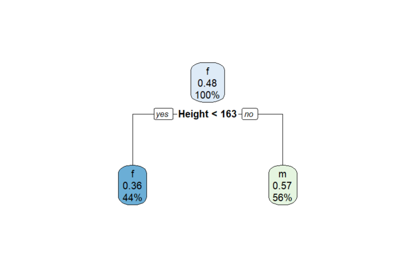

# Decision Tree Model for Gender Prediction Based on Height and Weight

## Problem Description

Using a dataset that includes `Height`, `Weight`, and `Gender` attributes, this code performs the following tasks:

1. **Builds a decision tree** to classify gender based on height and weight.
2. **Predicts gender** for a new data point.
3. **Visualizes the decision tree** structure.

---

## Dataset

The dataset is created within the code and consists of 25 observations with the following attributes:

- **Height (cm)**: Numeric values representing individuals' heights.
- **Weight (kg)**: Numeric values representing individuals' weights.
- **Gender (m/f)**: Randomly assigned gender labels, either `m` (male) or `f` (female).

### Random Gender Labels 😅

The gender labels (`m` and `f`) are generated randomly each time the code runs using the `sample` function in R. This random generation means the dataset changes with every execution, which results in slightly different decision tree structures each time you run the code.

> **Note**: You don’t have to use `sample` to generate `m` and `f`—you could manually specify the gender labels instead! But to keep things simple (and avoid typing `m` and `f` 25 times 😉), we’re using `sample` to randomize the labels.
### Important Note:
If only a single node appears in the decision tree visualization, it is due to the random generation of gender labels, which may sometimes create a dataset where the model can't find distinct decision splits. To observe different tree structures, try running the code multiple times or clicking **Source ➡️** in the R environment.

---

## Outputs

- **Decision Tree Visualization**: Shows the decision nodes and splits used to classify gender.
  

---
### Code

The code file for this decision tree model can be accessed here:

- [Decision Tree Code](./tree.r)
