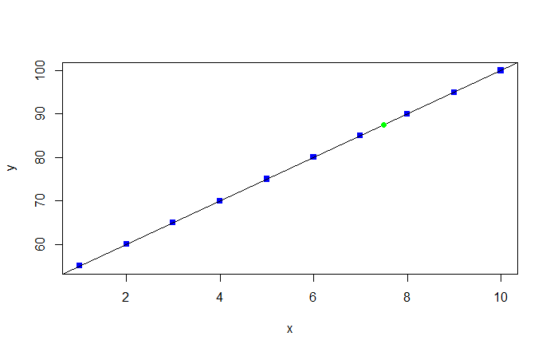

# Regression Analysis on Student Data

## Problem 1

Using the following dataset that represents a relationship between hours studied and exam scores, perform a linear regression analysis using RGraphics.
### Dataset

| Hours studied | Marks scored | 
| ----------- | --- | 
| 1           | 55  | 
| 2           | 60  | 
| 3           | 65  | 
| 4           | 70  | 
| 5           | 75  | 
| 6           | 80  | 
| 7           | 85  | 
| 8           | 90  |
| 9           | 95  | 
| 10          | 100  |

### Task:

- Using the model, predict the expected exam score for a student who studies for 7.5 hours.
- Create a scatter plot of the data with the regression line overlaid. Change the shape and color of points to any.
- Plot a histogram for input vector Marks Scored, then fill color of histogram to red.

### Outputs

Scatter Plot 

### [Click here for Problem 1 code](./linear_regression.r)

---

## Problem 2

Write a program in R to find the prime numbers within a given limit.

### [Click here for Problem 2 code](./prime_number.r)
